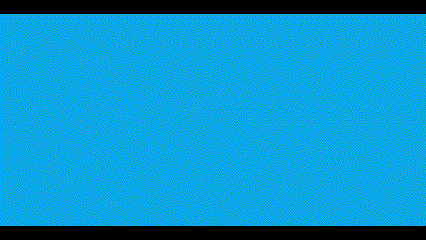

## About Me

  
Before kickoff

  ### Author:
  Xar Boer 
  Second year CMD student 
  they/them 

  #### My starting level:
  Red/Black

  #### My focus:
  Surface plane
 

## My Website

  
Before kickoff

  ### My project:
  I'm planning to recreate the promotional website for Persona 3 Reload, which can be found here. This site is dedicated to the remake of one of my all-time favorite games, Persona 3, which is part of the Shin Megami Tensei series. I really appreciate this website because it offers a wealth of information about the game, presenting it in a way that mirrors the game's own stylish and unique aesthetic. The design of the site is as captivating as the game itself, with a sleek and modern interface that captures the essence of Persona 3.

  #### Screenshots first page (small screen): 
  Front Page
  <table>
  <tr>
    <td>
      
       
      <small>Front Page</small>
    </td>
    <td>
      
       
      <small>Loading Screen</small>
    </td>
  </tr>
  <tr>
    <td>
      
       
      <small>Introduction Section</small>
    </td>
    <td>
      
       
      <small>Character Showcase</small>
    </td>
  </tr>
</table>

#### Screenshots second page (small screen): 

**Character Introduction**

<table>
  <tr>
    <td>
      
       
      <small>Character Detail Page</small>
    </td>
    <td>
      
       
      <small>Change Visual Button</small>
    </td>
  </tr>
</table>

_(Persona 3 Reload - Official Website, n.d.)_

## Toegankelijkheidstest 1/2 (week 1)

  
uitwerken na test in 2e werkgroep

  ### Bevindingen
  Lijst met je bevindingen die in de test naar voren kwamen:

## Breakdownschets (week 1)

  
uitwerken na afloop 3e werkgroep

  ### de hele pagina: 
  

  ### dynamisch deel (bijv menu): 
  

  ### wellicht nog een dynamisch deel (bijv filter): 
  

## Voortgang 1 (week 2)

  
uitwerken voor 1e voortgang

  ### Stand van zaken
  hier dit ging goed & dit was lastig (neem ook screenshots op van delen van je website en code)

  ### Agenda voor meeting
  samen met je groepje opstellen

  | student 1      | student 2          | student 3    | student 4        |
  | ---            | ---                | ---          | ---              |
  | dit bespreken  | en dit             | en ik dit    | en dan ik dat    |
  | en dat ook nog | dit als er tijd is | nog een punt | dit wil ik zeker |
  | ...            | ...                | ...          | ...              |

  ### Verslag van meeting
  hier na afloop snel de uitkomsten van de meeting vastleggen

  - punt 1
  - punt 2
  - nog een punt
  - ...

## Voortgang 2 (week 3)

  
uitwerken voor 2e voortgang

  ### Stand van zaken
  hier dit ging goed & dit was lastig (neem ook screenshots op van delen van je website en code)

  ### Agenda voor meeting
  samen met je groepje opstellen

  | student 1      | student 2          | student 3    | student 4        |
  | ---            | ---                | ---          | ---              |
  | dit bespreken  | en dit             | en ik dit    | en dan ik dat    |
  | en dat ook nog | dit als er tijd is | nog een punt | dit wil ik zeker |
  | ...            | ...                | ...          | ...              |

  ### Verslag van meeting
  hier na afloop snel de uitkomsten van de meeting vastleggen

  - punt 1
  - punt 2
  - nog een punt
- ...

## Toegankelijkheidstest 2/2 (week 4)

  
uitwerken na test in 9e werkgroep

  ### Bevindingen
  Lijst met je bevindingen die in de test naar voren kwamen (geef ook aan wat er verbeterd is):

## Voortgang 3 (week 4)

  
uitwerken voor 3e voortgang

  ### Stand van zaken
  hier dit ging goed & dit was lastig (neem ook screenshots op van delen van je website en code)

  ### Agenda voor meeting
  samen met je groepje opstellen

  | student 1      | student 2          | student 3    | student 4        |
  | ---            | ---                | ---          | ---              |
  | dit bespreken  | en dit             | en ik dit    | en dan ik dat    |
  | en dat ook nog | dit als er tijd is | nog een punt | dit wil ik zeker |
  | ...            | ...                | ...          | ...              |

  ### Verslag van meeting
  hier na afloop snel de uitkomsten van de meeting vastleggen

  - punt 1
  - punt 2
  - nog een punt
  - ...

## Eindgesprek (week 5)

  
uitwerken voor eindgesprek

  ### Je uitkomst - karakteristiek screenshots:
  

  ### Dit ging goed/Heb ik geleerd: 
  Korte omschrijving met plaatjes

  

  ### Dit was lastig/Is niet gelukt:
  Korte omschrijving met plaatjes

  

## Sources

  Persona 3 Reload - Official Website. (n.d.). Persona 3 Reload - Official Website. https://p3re.jp/en/

